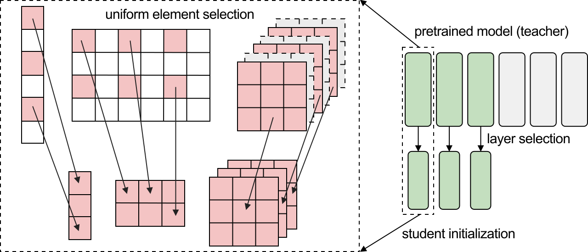

# Initializing Models with Larger Ones

Official code release for **Initializing Models with Larger Ones**

> [Initializing Models with Larger Ones](https://arxiv.org/abs/2311.18823)
> <br> [Zhiqiu Xu](https://oscarxzq.github.io), [Yanjie Chen](https://www.linkedin.com/in/yanjie-chen-69b914230/), [Kirill Vishniakov](https://kirill-vishniakov.github.io/), [Yida Yin](https://davidyyd.github.io/), [Zhiqiang Shen](https://zhiqiangshen.com/), [Trevor Darrell](https://people.eecs.berkeley.edu/~trevor/), [Lingjie Liu](https://lingjie0206.github.io), [Zhuang Liu](https://liuzhuang13.github.io)
> <br> University of Pennsylvania, UC Berkeley, MBZUAI, and Meta AI Research<br>

<p align="center">

</p>

We introduce **weight selection**, a method for initializing models by selecting a subset of weights from a pretrained larger model. With no extra cost, it is effective for improving the accuracy of a smaller model and reducing its training time needed to reach a certain accuracy level.


## Installation

Please check [INSTALL.md](INSTALL.md) for installation instructions. 

## Weight Selection

Please run `weight_selection.py` first to obtain the initialization file. We obtain the pretrained model via [timm](https://github.com/rwightman/pytorch-image-models) 0.6.12. The name for `--pretrained_model` might differ for a different timm version.

ViT-T initialization from ImageNet-21K pretrained ViT-S
```
python3 weight_selection.py \
--output_dir /path/to/weight_selection/ \
--model_type vit \
--pretrained_model vit_small_patch16_224_in21k
```

ConvNeXt-F initialization from ImageNet-21K pretrained ConvNeXt-T
```
python3 weight_selection.py \
--output_dir /path/to/weight_selection/ \
--model_type convnext \
--pretrained_model convnext_tiny_in22k
```


## Training

We list commands for training on `ViT-T` and `ConvNeXt-F` on CIFAR-100 and ImageNet.
- To run baseline (train from random initialization), remove `--initialize` command.


ViT-T from weight selection on CIFAR-100
```
python -m torch.distributed.launch --nproc_per_node=8 main.py \
--model vit_tiny  --warmup_epochs 50 --epochs 300 \
--batch_size 64 --lr 2e-3 --update_freq 1 --use_amp true \
--initialize /path/to/weight_selection \
--data_path /path/to/data/ \
--data_set CIFAR100 \
--output_dir /path/to/results/
```

ConvNeXt-F from weight selection on CIFAR-100
```
python -m torch.distributed.launch --nproc_per_node=8 main.py \
--model convnext_femto  --warmup_epochs 50 --epochs 300 --drop_path 0.1 \
--batch_size 128 --lr 4e-3 --update_freq 1 --use_amp true \
--initialize /path/to/weight_selection \
--data_path /path/to/data/ \
--data_set CIFAR100 \
--output_dir /path/to/results/
```

ViT-T from weight selection on ImageNet-1K
```
python -m torch.distributed.launch --nproc_per_node=8 main.py \
--model vit_tiny --epochs 300 \
--batch_size 128 --lr 4e-3 --update_freq 4 --use_amp true \
--initialize /path/to/weight_selection \
--data_path /path/to/data/ \
--output_dir /path/to/results/
```

ConvNeXt-F from weight selection on ImageNet-1K
```
python -m torch.distributed.launch --nproc_per_node=8 main.py \
--model vit_tiny --epochs 300 \
--batch_size 128 --lr 4e-3 --update_freq 4 --use_amp true \
--initialize /path/to/weight_selection \
--data_path /path/to/data/ \
--output_dir /path/to/results/
```

## Result

CIFAR-100 and ImageNet-1K results of initializing ViT-T and ConvNeXt-F with weight selection from ImageNet-21K pretrained ViT-S and ConvNeXt-T

| setting        | ViT-T | ConvNeXt-F |
|:------------|:-----:|:----------:|
| train from random init (CIFAR-100)     | 72.4  |   81.3     |
| weight selection (CIFAR-100)   | **81.4**  | **84.4**          |
| train from random init (ImageNet-1K)    | 73.9 | 76.1       |
| weight selection (ImageNet-1K)  | **75.6**  | **76.4**         |


## Acknowledgement
This repository is built using the [timm](https://github.com/rwightman/pytorch-image-models) library and [Dropout](https://github.com/facebookresearch/dropout) codebase.

## Citation
If you find this repository helpful, please consider citing
```
@article{xu2023initializing,
      title={Initializing Models with Larger Ones}, 
      author={Zhiqiu Xu and Yanjie Chen and Kirill Vishniakov and Yida Yin and Zhiqiang Shen and Trevor Darrell and Lingjie Liu and Zhuang Liu},
      year={2023},
      journal={arXiv preprint arXiv:2311.18823},
}
```